# Sql_Injection_Example
Vulnerable website hacked with SQL Injection

## AIM:
To visit the following website, and find the flag:
https://vlab.space 

## PROCEDURE
There are suitable steps that should be done in order to get the "flag".

### STEP 1 : GOING THROUGH THE GIVEN WEBSITE TO GET THE TARGET LOGIN PAGE

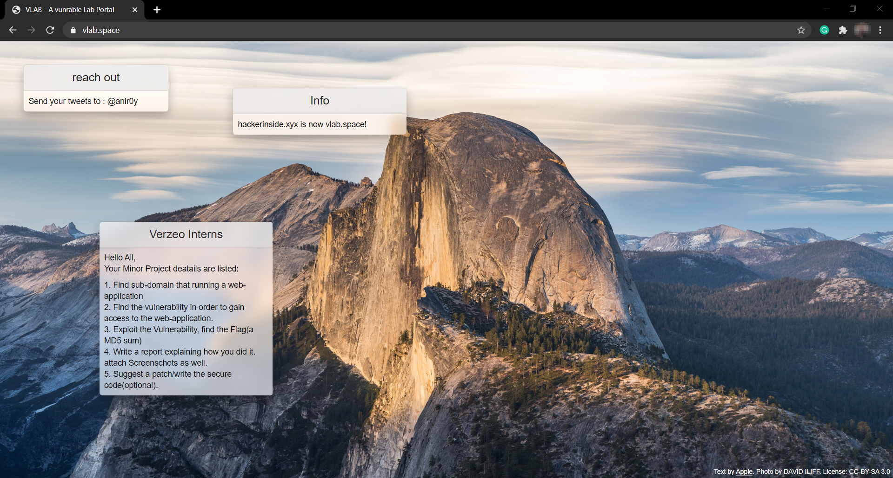

Now let's search the sub-domain with login page has a SQL injection vulnerability.

To accomplish this, we have to search for all sub-domains that this domain has, we can do this by modifying the URL.

Here `/sitemap.xml` to the original url. **It acts as a roadmap of the website**, allows us to find essential pages constituting to a website. Also makes the **site's structure as clear as possible**. Hence, its prefferable to use it as our aim is to find the login page.

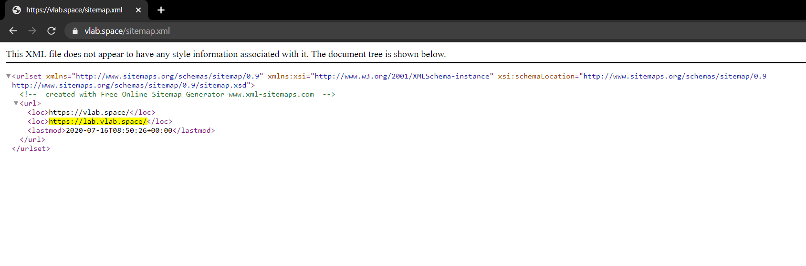

By observing the results, we can see that there is a sub-domain namely: https://lab.vlab.space (highlighted).
So let's check it out!!

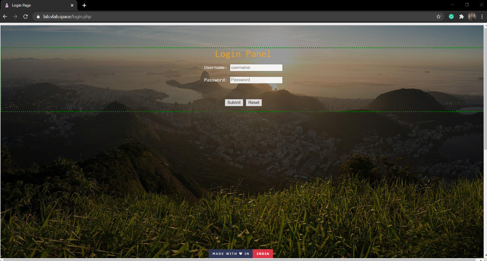

Voila!
We got the login page.

##### *Step 1 completed* :clap:
---

### STEP 2 : USING BURPSUITE TO GET THE POST REQUEST (PREINSTALLED IN KALI LINUX)

Click [here](https://portswigger.net/burp) to download Burpsuite

- Run **Burpsuite**
- Get the details of the proxy listener (Shown in the snapshot below)

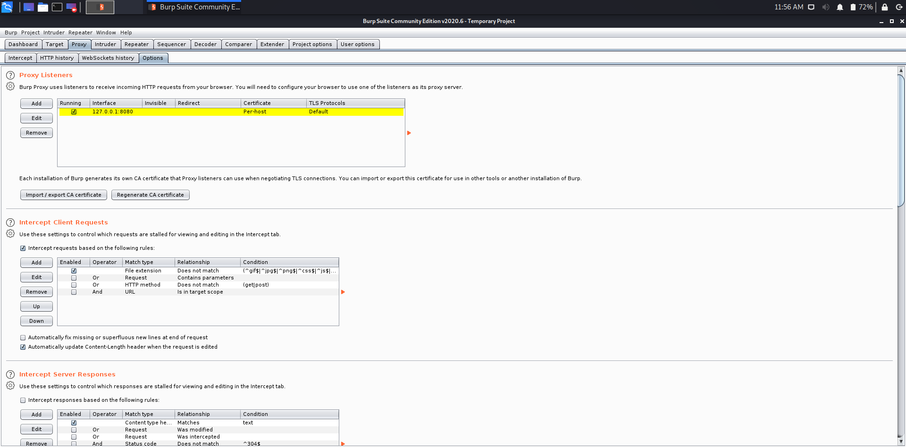

Now to successfully intercept the **POST request**, we need to set up a proxy. Here, we'll do it by using a Firefox extension called **FoxyProxy** which will help us to switch to a proxy server specified in Burpsuite.

Click [here](https://addons.mozilla.org/en-US/firefox/addon/foxyproxy-standard/) to add FoxyProxy to Firefox.
When it gets added, click on it and follow the **options** button, you'll be redirected to this page shown below from where a proxy server can be added. For doing that, click the **Add** button.

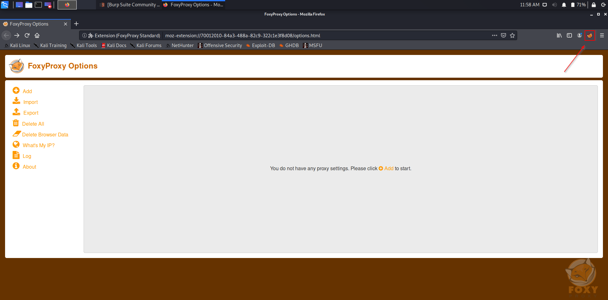

Here, in this page details of the proxy listener from Burpsuite should be added. (Screenshot of the same is shown below)

After the details are filled, click on **Save**, and activate the proxy.

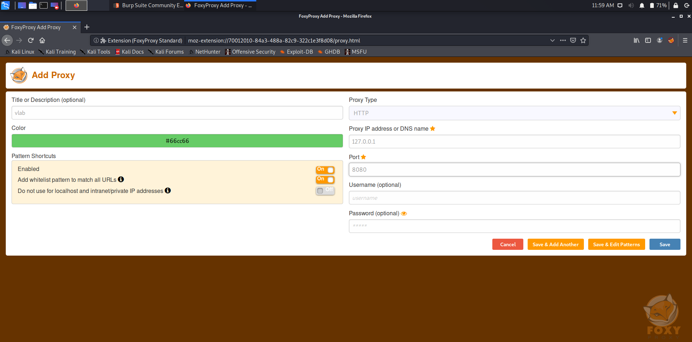

The Proxy gets set up.

> ***NOTE - The portswigger certificate should be downloaded***

Once successfully downloaded, access the target login page (which is shown below).

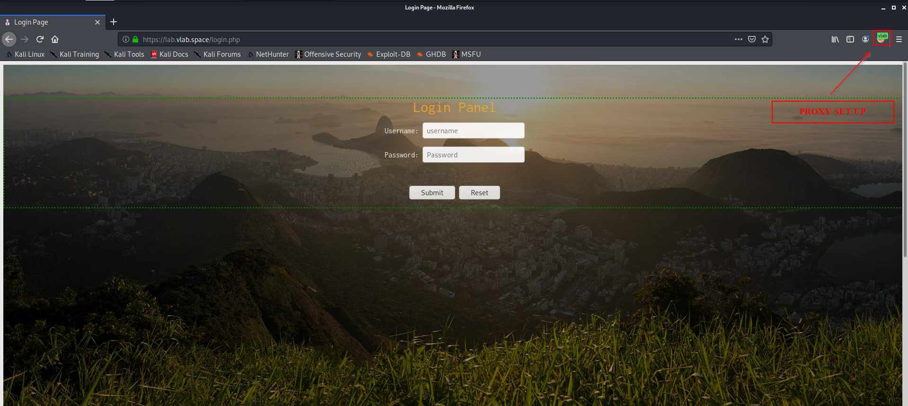

Before filling the login form, get back to Burpsuite and turn the Intercept "off" option to "on".

Now, fill the login form (*here I used "admin" as both username and password*). When **Submit** is clicked, the Burpsuite window appears, which contains the POST request information. 
Now click on the **Action** button and click on **Copy to file**, and save it with extension **.req**  (*In my case, I saved it as vlabLogin.req*)

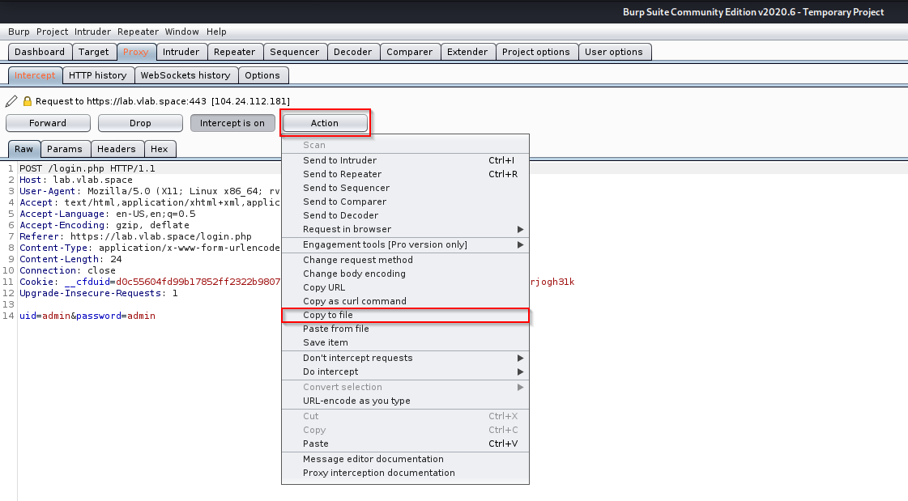

##### *Step 2 completed* :muscle:
---

Now to work on this .req file and hack into the database, and find the table entries:

### STEP 3 : USING SQLMAP(PREINSTALLED IN KALI LINUX) TO GET THE FLAG

Click [here](http://sqlmap.org/) to download Sqlmap.

To get the databases:
- Open the Terminal.
- Navigate into the location where .req file is saved.
- Perform this command:

  `sqlmap -r <filename>.req --dbs`
 
> Output
 
 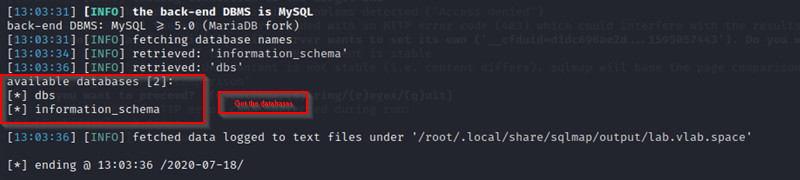
 
Here we can see that there are two databases present:
Lets select the "**dbs**" database.
 
Now the next aim is to get the tables of the database.
To get the tables:
- Perform this command:

  `sqlmap -r <filename>.req -D dbs --tables`
 
> Output
 
 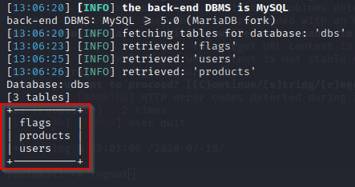
 
 ##### Extracting data from flags table
 
 The aim here is to dump the table entries and get the flag.
 - For that, perform this command:
   
   `sqlmap -r <filename>.req -D dbs -T flags --dump`

> Output

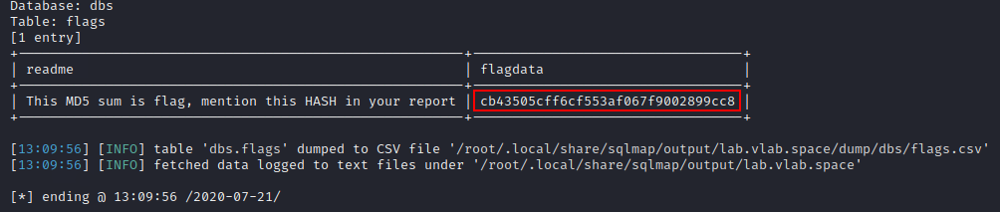

Hence, the required MD5 sum (flag) is : **cb43505cff6cf553af067f9002899cc8**

##### For a bonus, let's extract data from users table :wink:

The aim here is to dump the table entries and get the usernames and passwords.

- For that, perform this command:
  
  `sqlmap -r <filename>.req -D dbs -T users --dump`

> Output

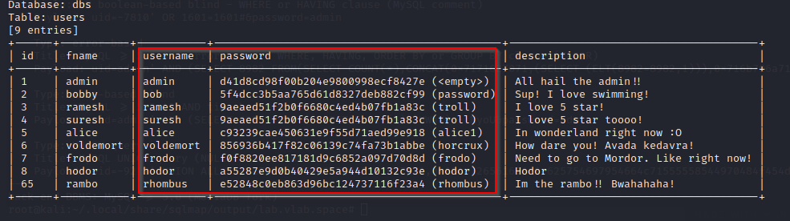

Hence found the usernames and passwords.

---

EOF :sunglasses:
